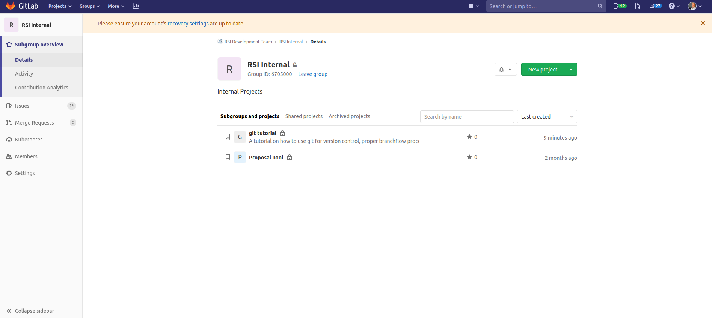
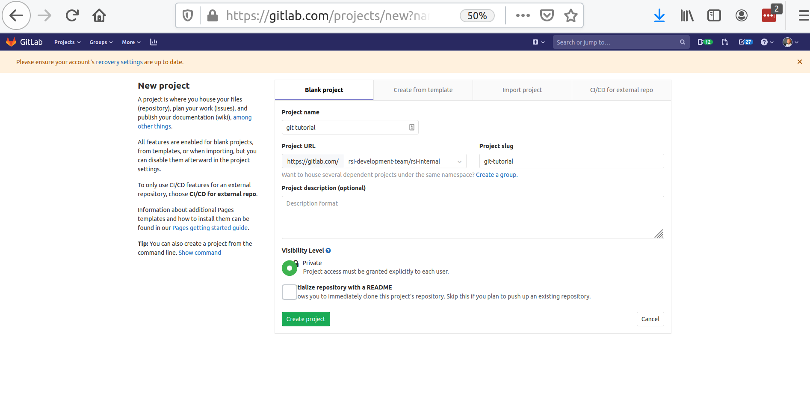
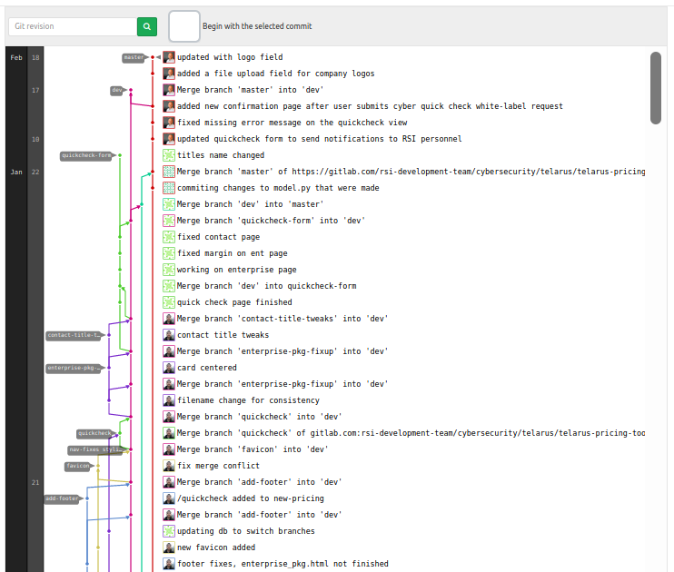

# Git Tutorial
This tutorial is intended to teach you how to use git for version control, proper branch workflow, and handling merge conflicts.

## Let us create a git repository
Navigate to the project in gitlab underwhich you'd like to create your repository and, near the top-right corner, click the green "New Project" button. I am creating this one under RSI Development Team > RSI Internal and naming it "git tutorial".

Fill in the project name and click the green "Create Project" button at the bottom. Then, follow the instructions for cloning your repo to your computer.

## Let us create our first file, the README.md
Currently, you are on the master branch. The master branch should be reserved for production code only. Lets initialize a README.md and then switch over to a new branch, which we will call 'dev'.

    touch README.md

    git add README.md
    git commit -m 'initialized README.md'
    git push

    git checkout -b dev

let us break down the git commands:

git add - stages the file for commiting

git commit -m - appends a custom note to describe changes that were made

git push - pushes the changes to the repository

git checkout -b - use 'git checkout' to checkout another existing branch. Use the '-b' to create a new branch.

## Let us create a new source code file
Open a file called main.py and insert the following into it:

    def main():
        print('helloworld!')

    main()

Now add our new file, commit and push:

    git add main.py
    git commit -m 'initialized main.py'
    git push --set-upstream origin dev

Note, on new branches, your very first push will have to include '--set-upstream origin <i>branch-name</i>'.

## Branch workflow
Suppose you have two developers. Both of them notice the error in our print statement, i.e., there is no space between 'hello' and 'world!'.

The proper thing to do would be to make a new 'hot-fix' branch off of dev, fix the error, and then merge back into dev. One developer does the proper method while the other fixes it directly on dev.

Let us assume you are the second developer. Create a new branch called 'hot-fix'.

    git checkout -b hot-fix

Open up 'main.py' and change it to the following:

    def main():
        print('hello world!')

    main()

Now let us add, commit, and push.

    git add main.py
    git commit -m 'fixed typo'
    git push --set-upstream origin hot-fix

Meanwhile, let us assume the other developer is also editing 'main.py' on the dev branch. Checkout dev and change 'main.py' to the following:

    def main():

        print('Hello World!!!')

    main()

Now add, commit, and push:

    git add main.py
    git commit -m 'fixed typo'
    git push

Now, let us assume that the developer on the hot-fix branch is ready to merge their changes back into dev. First run the following:

    git merge dev hot-fix

This will tell you if there are going to be any conflicts, which based off of the message we received:

    Auto-merging main.py
    CONFLICT (content): Merge conflict in main.py
    Automatic merge failed; fix conflicts and then commit the result.

we have a conflict. The message says the conflict is in 'main.py'. If you open 'main.py', you will see the following:

    def main():
    <<<<<<< HEAD
        print('hello world!')
    =======
    
        print('Hello World!!!')
    >>>>>>> dev

    main()

the <<<<<<< HEAD section represents the source code on the hot-fix branch, while the >>>>>>> dev version is on dev. To fix the conflict, you must choose to either keep one of the versions, or make something completely different. To keep the hot-fix version, simply delete <<<<<<<< HEAD, and everything between ======== and >>>>>>>> dev to make 'main.py' look like the following:

    def main():
        print('hello world!)

    main()

Now add, commit, and push.

    git add main.py
    git commit -m 'fixed conflicts'
    git push

Now checkout dev and run the following:

    git merge hot-fix dev
    git push

The typo has been fixed, conflicts mitigated, and the hot-fix has been merged into the dev branch. Note, conflicts happen when two or more people on separate branches are editing the same lines of code. Developers on separate branches should be working on different portions of the code, which is part of the ideal branch workflow.

## The ideal branch workflow

Whether you are working on a hot-fix, or adding a new feature, you should branch off of dev. While off of dev, you should commit often. Break tasks down into small enough segments that you can finish your branches and merge back to dev daily. An ideal branch workflow looks like this:

Any time the current version of dev is production ready, we'll want to merge dev with master.

    git merge master dev
    git checkout master
    git merge dev master
    git push

    git checkout dev

And that's it! This sums up the git workshop on basic git commands, branch workflow, and mitigating merge conflicts. For anything else, please refer to https://www.git-tower.com/blog/git-cheat-sheet/

